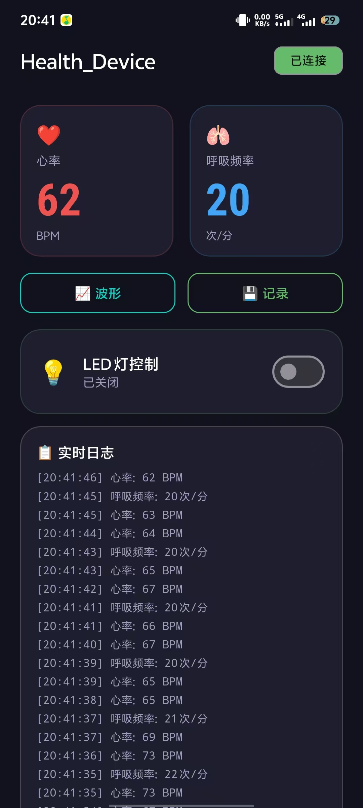
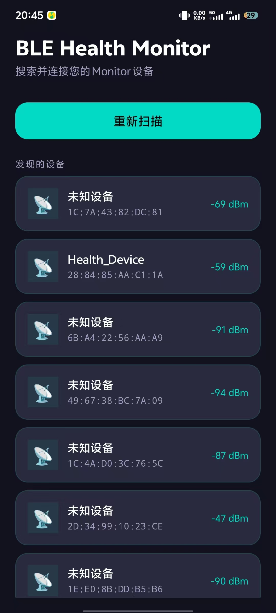
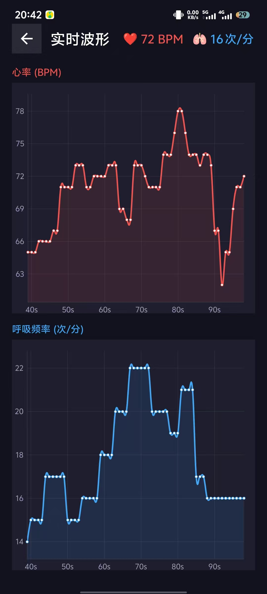
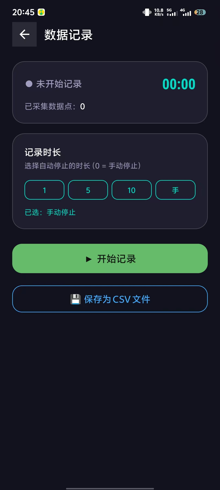

| Supported Targets | ESP32 | ESP32-C2 | ESP32-C3 | ESP32-C5 | ESP32-C6 | ESP32-C61 | ESP32-H2 | ESP32-S3 |
| ----------------- | ----- | -------- | -------- | -------- | -------- | --------- | -------- | -------- |

# Bluedroid GATT Server — 健康监测设备

## 概述

本项目基于 ESP-IDF 的 Bluedroid 协议栈，实现了一个 BLE GATT 服务器，模拟一台**健康监测设备**。设备通过 BLE 对外暴露心率、呼吸频率和 LED 控制三个 GATT 服务，并集成了雷达传感器数据接收、异常报警和按键交互等硬件功能。

### 主要功能

1. **GATT 服务**
   - **心率服务** (Heart Rate Service, UUID: `0x180D`)：支持读取和指示 (Indicate) 心率测量值
   - **自动化 IO 服务** (Automation IO Service, UUID: `0x1815`)：支持通过 BLE 写入控制 LED 开关
   - **呼吸频率服务** (自定义 128-bit UUID)：支持读取和指示呼吸频率测量值

2. **雷达传感器数据接收**
   - 通过 UART1 接收外部雷达传感器数据帧
   - 帧格式：16 字节 (2 字节帧头 + 1 字节标志 + 4 字节计数 + 4 字节呼吸值 + 4 字节心率值 + 1 字节 CRC-8)
   - 5 帧均值滤波，平滑输出呼吸和心率数据

3. **异常报警**
   - 通过 KEY2 按键开关报警功能
   - 心率异常阈值：< 40 bpm 或 > 120 bpm
   - 呼吸异常阈值：< 8 次/分钟 或 > 30 次/分钟
   - 异常时蜂鸣器 (GPIO37) 报警

4. **按键交互**
   - 4 个按键 (GPIO15, GPIO8, GPIO41, GPIO4)，内置消抖处理

## 硬件连接

| 外设   | GPIO 引脚 | 说明                       |
| ------ | --------- | -------------------------- |
| LED    | 可配置    | 支持普通 GPIO LED 或 WS2812 |
| 蜂鸣器 | GPIO37    | 低电平触发，报警输出       |
| KEY1   | GPIO15    | 上拉输入，按下为低电平     |
| KEY2   | GPIO8     | 上拉输入，切换报警开关     |
| KEY3   | GPIO41    | 上拉输入                   |
| KEY4   | GPIO4     | 上拉输入                   |
| UART1  | GPIO17(TX), GPIO18(RX) | 115200bps，连接雷达传感器 |

## 快速开始

### 设置目标芯片

```shell
idf.py set-target <chip_name>
```

例如使用 ESP32-S3：

```shell
idf.py set-target esp32s3
```

### 配置项目

```shell
idf.py menuconfig
```

在 `Example 'GATT SERVER' Config` 菜单中可配置：
- **Blink LED type**：选择 LED 类型（普通 GPIO 或可寻址 LED 灯带）
- **Blink GPIO number**：设置 LED 连接的 GPIO 引脚（默认 GPIO8）

### 编译、烧录和监视

```shell
idf.py -p <PORT> flash monitor
```

例如：

```shell
idf.py -p /dev/ttyACM0 flash monitor
```

（按 `Ctrl-]` 退出串口监视器。）

## BLE 服务与特征

### 1. 心率服务 (Heart Rate Service)

| 项目         | 值                                         |
| ------------ | ------------------------------------------ |
| 服务 UUID    | `0x180D` (标准心率服务)                    |
| 特征 UUID    | `0x2A37` (心率测量值)                      |
| 属性         | Read, Indicate                             |
| 描述符       | `0x2902` (Client Characteristic Configuration) |
| 数据格式     | 2 字节，`[flags, heart_rate_bpm]`          |

### 2. 自动化 IO 服务 (Automation IO Service)

| 项目         | 值                                                                 |
| ------------ | ------------------------------------------------------------------ |
| 服务 UUID    | `0x1815` (标准自动化 IO 服务)                                      |
| 特征 UUID    | `ceaed123-785f-1523-defe-121225150000` (128-bit 自定义)            |
| 属性         | Write                                                              |
| 数据格式     | 写入非零值 → LED 开；写入零值 → LED 关                             |

### 3. 呼吸频率服务 (Respiration Service)

| 项目         | 值                                                                 |
| ------------ | ------------------------------------------------------------------ |
| 服务 UUID    | `ceaed123-785f-1523-defe-121226150000` (128-bit 自定义)            |
| 特征 UUID    | `ceaed123-785f-1523-defe-121226160000` (128-bit 自定义)            |
| 属性         | Read, Indicate                                                     |
| 描述符       | `0x2902` (Client Characteristic Configuration)                     |
| 数据格式     | 2 字节，`[flags, respiration_rate_bpm]`                            |

## 代码结构

```
main/
├── CMakeLists.txt          # 组件构建配置
├── Kconfig.projbuild       # 项目 Kconfig 配置项
├── main.c                  # 主程序入口，蓝牙初始化与 GATT 事件处理
├── include/
│   ├── alarm.h             # 报警模块接口
│   ├── buzzer.h            # 蜂鸣器驱动接口
│   ├── heart_rate.h        # 心率模拟接口
│   ├── key.h               # 按键驱动接口
│   ├── led.h               # LED 驱动接口
│   ├── radar_receiver.h    # 雷达数据接收器接口
│   ├── respiration.h       # 呼吸频率模拟接口
│   └── uart.h              # UART 驱动接口
└── src/
    ├── alarm.c             # 报警监控任务实现
    ├── buzzer.c            # 蜂鸣器 GPIO 控制
    ├── heart_rate_mock.c   # 心率数据模拟 (可融合雷达数据)
    ├── key.c               # 按键扫描与消抖
    ├── led.c               # LED 控制 (GPIO/RMT/SPI)
    ├── radar_receiver.c    # 雷达帧解析与均值滤波
    ├── respiration_mock.c  # 呼吸频率模拟 (可融合雷达数据)
    └── uart.c              # UART1 初始化
```

## 工作流程

### 1. 初始化阶段

1. 初始化 LED、按键、蜂鸣器、报警模块
2. 初始化 UART1，用于接收雷达传感器数据
3. 初始化雷达数据接收器（均值滤波 + 5 帧环形缓冲）
4. 初始化 NVS Flash
5. 释放经典蓝牙控制器内存，仅保留 BLE 模式
6. 初始化并启动蓝牙控制器和 Bluedroid 协议栈
7. 设置设备名为 `Health_Device`
8. 注册 GAP 和 GATT 事件回调
9. 注册三个 GATT 服务应用：心率、自动化 IO、呼吸频率
10. 设置本地 MTU 为 500 字节
11. 启动三个 FreeRTOS 任务：心率更新、呼吸频率更新、报警监控

### 2. 广播与连接

- 设备以可连接的非定向广播模式工作
- 广播间隔：20ms ~ 40ms
- 连接间隔：最小 7.5ms，最大 20ms
- 连接建立后主动请求更新连接参数

### 3. 数据更新

- **心率更新任务**：每 1 秒从雷达数据（如有）获取心率值，更新 GATT 属性，若指示已启用则发送 Indicate
- **呼吸频率更新任务**：每 2 秒从雷达数据（如有）获取呼吸频率，更新 GATT 属性，若指示已启用则发送 Indicate
- **报警监控任务**：每 500ms 检测一次，当 KEY2 开启报警后，若心率或呼吸频率超出阈值，蜂鸣器报警

### 4. 雷达数据流

```
雷达传感器 → UART1 (RX: GPIO18) → 帧解析 (16字节) → CRC-8 校验
→ 均值滤波 (5帧) → 心率/呼吸频率 → 更新 GATT 属性
```

## 报警阈值

| 参数           | 下限    | 上限    |
| -------------- | ------- | ------- |
| 心率 (bpm)     | 40      | 120     |
| 呼吸 (次/分钟) | 8       | 30      |

可通过修改 `main/include/alarm.h` 中的宏定义 `ALARM_HEART_RATE_MIN`、`ALARM_HEART_RATE_MAX`、`ALARM_RESPIRATION_MIN`、`ALARM_RESPIRATION_MAX` 来调整阈值。

## 测试方法

可使用任意 BLE 扫描/调试工具进行测试，推荐使用 **nRF Connect** 手机 App：

1. 扫描并连接设备 `Health_Device`
2. 查看心率服务 (0x180D)，可读取心率值或订阅 Indicate 接收实时更新
3. 查看自动化 IO 服务 (0x1815)，写入任意值控制 LED 开关
4. 查看呼吸频率服务（自定义 UUID），可读取呼吸频率或订阅 Indicate
5. 按下 KEY2 开启报警功能，当心率或呼吸频率异常时蜂鸣器将报警

## APP 界面展示

配套 Android APP 各页面截图如下：

<table>
  <tr>
    <td align="center"><b>主界面</b></td>
    <td align="center"><b>设备搜索</b></td>
  </tr>
  <tr>
    <td></td>
    <td></td>
  </tr>
  <tr>
    <td align="center"><b>数据展示</b></td>
    <td align="center"><b>本地保存</b></td>
  </tr>
  <tr>
    <td></td>
    <td></td>
  </tr>
</table>

## 更多参考

- [ESP-IDF 快速入门指南](https://docs.espressif.com/projects/esp-idf/zh_CN/latest/esp32/get-started/index.html)
- [Bluetooth API 参考](https://docs.espressif.com/projects/esp-idf/zh_CN/latest/esp32/api-reference/bluetooth/index.html)